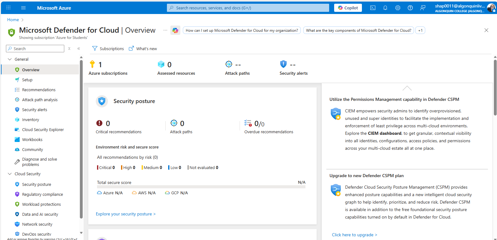

# CST8919 – DevOps Security and Compliance

## Lab 1 – Cloud Security & Compliance Orientation

**Completed by: Olga Durham**
**St#: 040687883**

---

### Objective

Identify where identity, audit logs, and security posture live in a cloud platform.  

Complete the lab using both GUI and CLI workflows.  You can choose either AWS or Azure for this exercise, no new account

*Note: This lab was completed using Microsoft Azure only. AWS steps were not performed.*

---

### Azure Portal Steps

1. Sign in to Azure Portal
2. Navigate to:
    - Microsoft Entra ID
    - Activity Log
    - Microsoft Defender for Cloud
3. In Activity Log:
    - Filter by Administrative events
    - Identify:
        - Caller
        - Timestamp
        - Resource affected
4. Locate:
    - A recent configuration change

---

### Azure CLI

Run Entra ID, Activity Log, or Policy commands to generate audit activity.
*Look them up in the docs.*

**Azure CLI – Activity Log**

Selected the correct subscription: 

```bash
az account list --output table
az account set --subscription "Azure for Students"
az account show --output table
```

Retrieved resent Activity Log entries using Azure CLI:

```bash
az monitor activity-log list --max-events 5 --output table
```

---

### Evidence

#### Identity - Microsoft Entra ID

*Access to Microsoft Entra ID is restricted*


Access to Microsoft Entra ID was restricted due to role-based access control. This demonstrates how identity management is protected and limited to privileged roles in Azure.

#### Audit Logs - Azure Activity Log

*Azure Activity Log showing the creation of a resource group, including caller, timestamp, and affected resource.*


The Azure Activity Log recorded an administrative write operation when a new resource group was created. The event identifies the caller, timestamp, and affected resource, demonstrating audit visibility using the Activity view.

#### Security Posture - Microsoft Defender for Cloud

*Microsoft Defender for Cloud Overview, Secure Score, and Recommendations*


Microsoft Defender for Cloud provides visibility into the security posture of Azure resources by assessing configurations and generating security recommendations.

---

### Reflection

Visibility is a prerequisite for security enforcement because organizations cannot protect or control assets they cannot see. Audit logs provide insight into who performed actions and when, while security posture tools help identify misconfigurations and potential risks. Without visibility into user activity, resource changes, and overall security status, enforcing policies, detecting incidents, and responding to threats becomes ineffective.