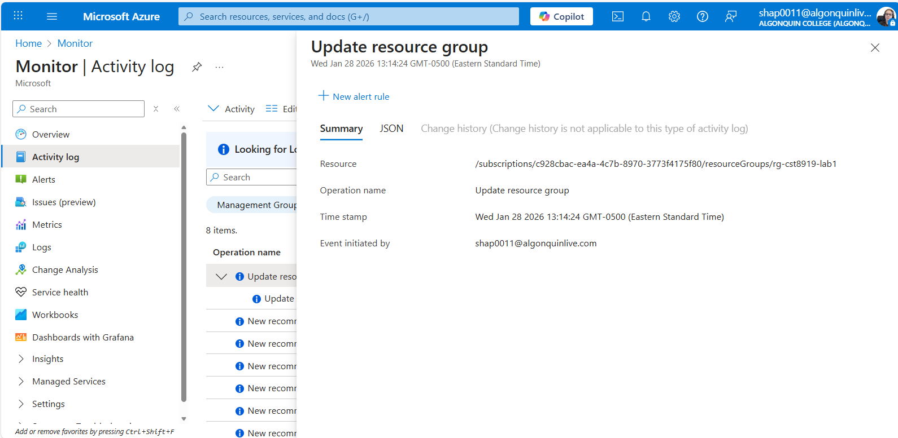

# CST8919 – DevOps Security and Compliance

## Lab 1 – Cloud Security & Compliance Orientation

**Completed by: Olga Durham**
**St#: 040687883**

---

### Objective

Identify where identity, audit logs, and security posture live in a cloud platform.  

Complete the lab using both GUI and CLI workflows.  You can choose either AWS or Azure for this exercise, no new account

---

### AWS Console Steps

1. Sign in to the AWS Management Console
2. Navigate to:
    - IAM → Users / Roles
    - CloudTrail → Event history
    - Security Hub (if enabled)
3. In CloudTrail:
    - Filter by Event name = ConsoleLogin
    - Identify:
    - User / role
    - Timestamp
    - Source IP
4. Locate:
    - One Create / Update / Delete action on any resource

*Access to Microsoft Entra ID is restricted*

Access to Microsoft Entra ID was restricted due to role-based access control. This demonstrates how identity management is protected and limited to privileged roles in Azure.

*Azure Activity Log showing the creation of a resource group, including caller, timestamp, and affected resource.*

An administrative action was recorded in the Azure Activity Log when a new resource group was created. The log shows the caller, timestamp, and affected resource, demonstrating Azure’s audit logging and accountability.

---

### AWS CLI

Run IAM, CloudTrail, or policy-related commands to generate audit activity.
*Look them up in the docs.*

**Azure Portal Steps**

1. Sign in to Azure Portal
2. Navigate to:
    - Microsoft Entra ID
    - Activity Log
    - Microsoft Defender for Cloud
3. In Activity Log:
    - Filter by Administrative events
    - Identify:
    - Caller
    - Timestamp
    - Resource affected
4. Locate:
    - A recent configuration change

**Azure CLI**

Run Entra ID, Activity Log, or Policy commands to generate audit activity.
*Look them up in the docs.*

**Evidence**

Screenshots, logs, and short explanations are required ...

e.g.

- Screenshot of an audit event
- Written identification of who did what and when

**Reflection**

Why is visibility a prerequisite for security enforcement?

**Submission**

Put your screenshots and observations, including the reflection in a PDF doc and upload to Brightspace.

